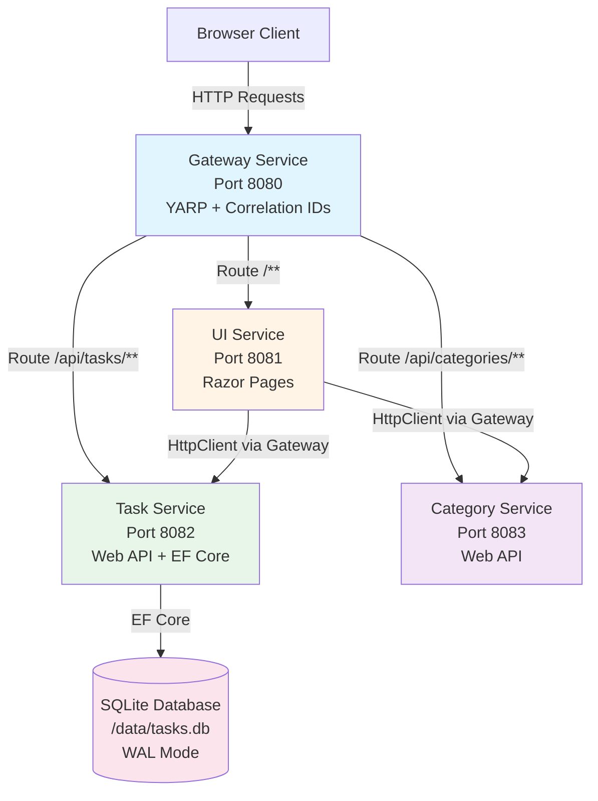
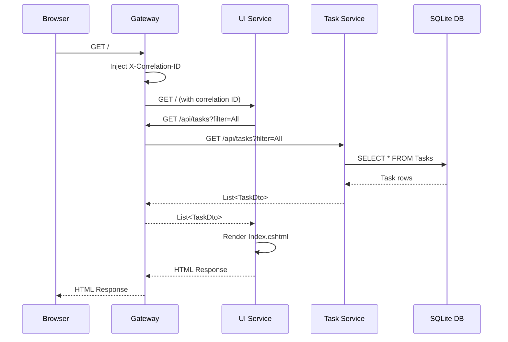
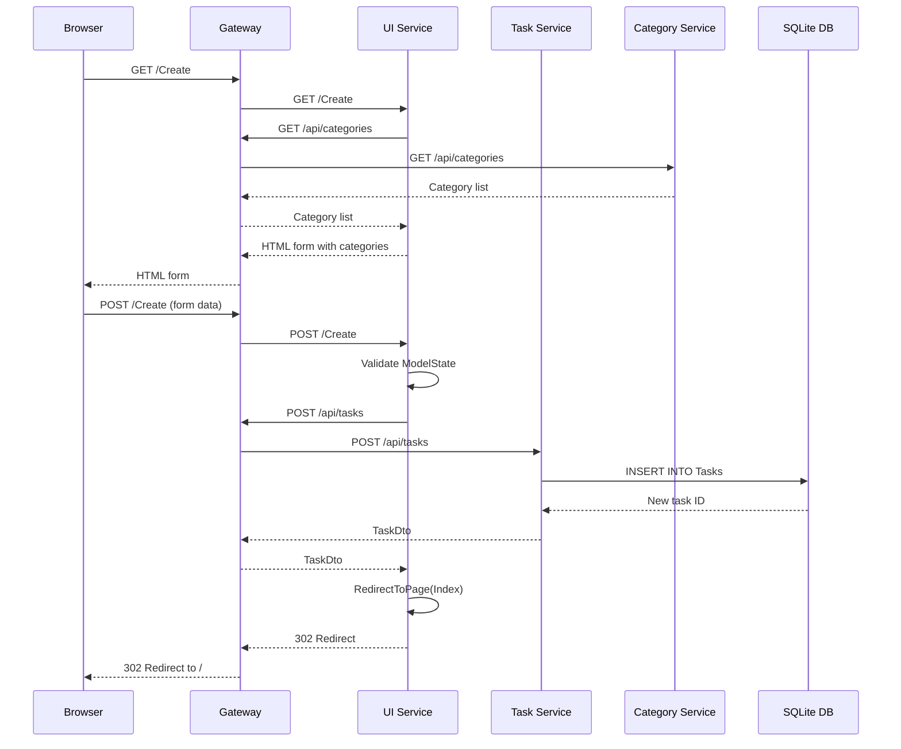
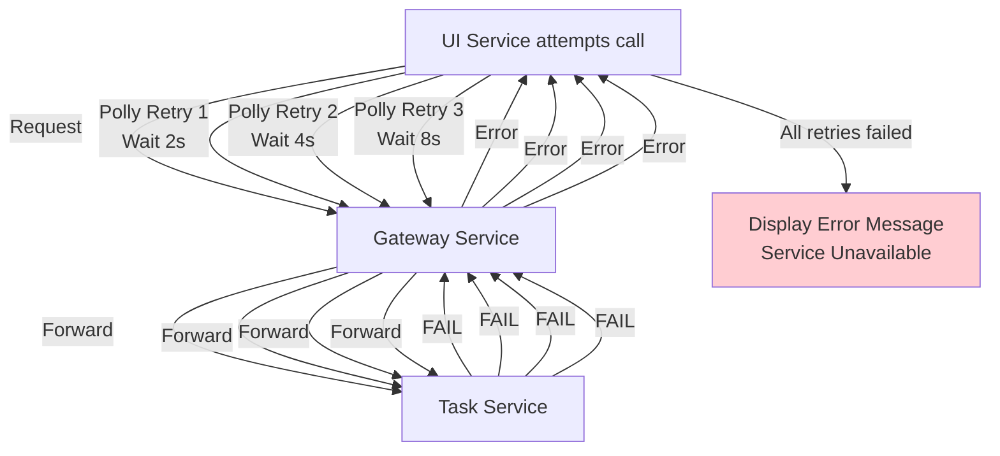
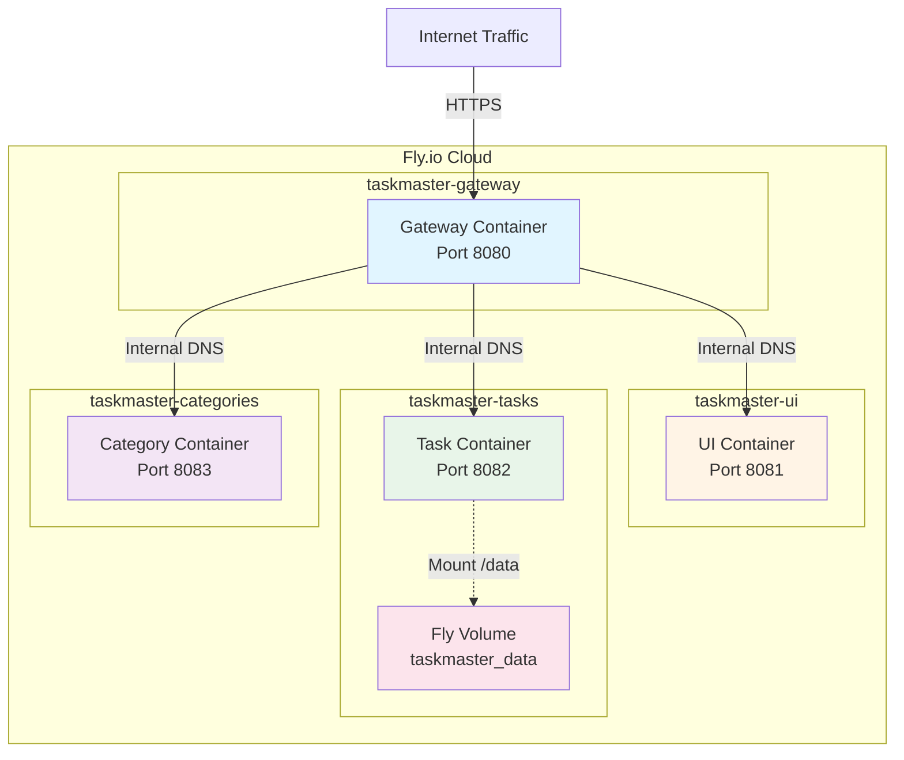
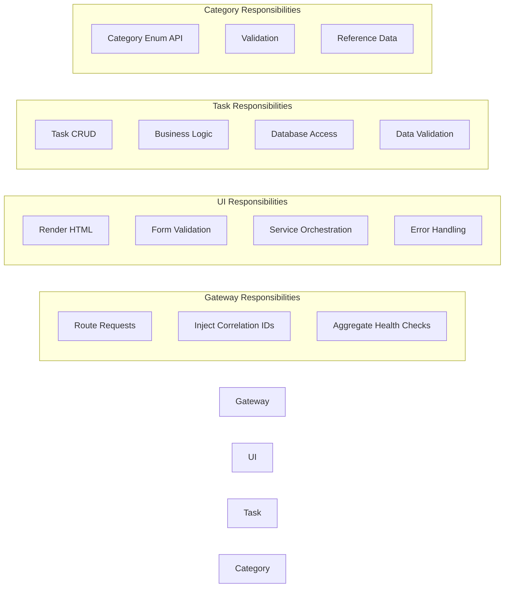
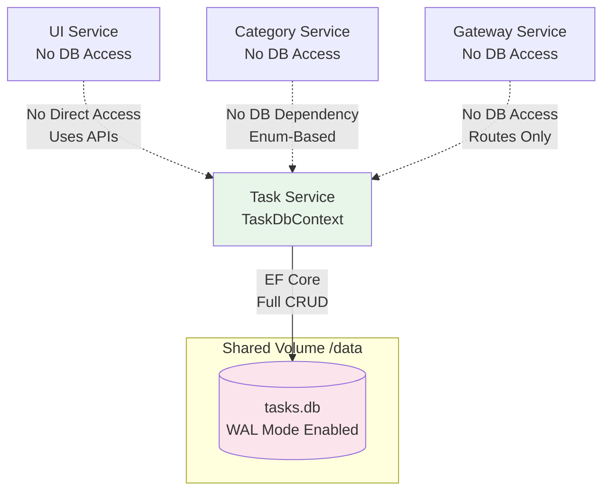

# TaskMaster Microservices Architecture - Visual Diagrams

## Service Communication Flow

## Request Flow: View Tasks

## Request Flow: Create Task

## Error Handling with Polly

## Deployment Architecture

## Service Responsibilities Matrix

## Database Access Pattern

